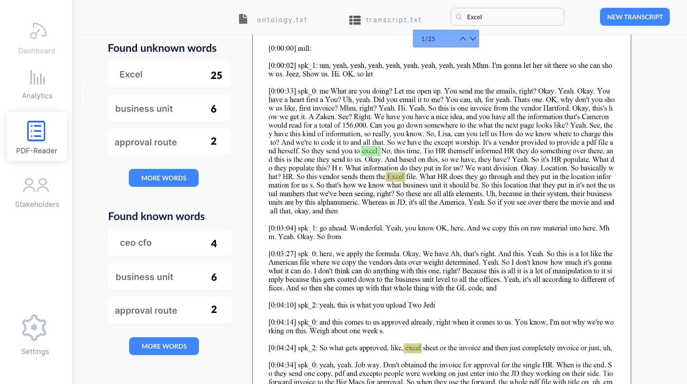

# Key Extractor Project 

This page servers as a wiki for the research project documented in the paper: "Information Detection in Business Analysis Transcripts; an Ontology Approach", written by Boris Winter, Tjerk Spijkman and Sid Bansidhar. This project was executed for the Software Production course at Utrecht University. 

## NLP Tool

## Code 
The NLP tool that has been created was made in Python (.ipnyb), which can be found at: https://github.com/Bowis/keyextractor. It consists of 4 files: 
- **splitter.ipynb**: this file is able to split the transcripts into multiple sentences, allowing further tokenization. 
- **nltk.ipynb**: this file can be used to get some basic statistics of the transcript that is entered. 
- **known.ipynb**: this file is able to match and count known terms (present in the ontology/ontology.txt file) that are present in the transcript that is entered. 
- **unknown.ipynb**: this file is able to find possibly unknown terms in the transcript with the use of the Textblob package (https://textblob.readthedocs.io/en/dev/). 

## Dasbhoard
The dashboard is an extension of the NLP tool created during the research. It visualizes the generated results in a concise manner, and allows business analyst and other users to quickly identify existing and unknown concepts in the uploaded transcript. 

A mockup of this dashboard has been drafted during the research project, which will be elaborated on in the following section. 
### Upload Page

In the first screen of the dashboard, shown in the image above, the user is able to upload a transcript and a ontology file. The ontology file is used to match the transcript against. Once the user has uploaded both files, he/she can start the transcription process. 
### Dashboard Page 

Once the transcription process has been completed, the user is presented with the dashboard. In the current version of the mockup, the dasboard consists of four main elements: 
* **Transcript statistics:** some general statistics of the processed transcript, such as the total amount of words in the transcript. 
* **Possible transcript subjects:** here the algorithm makes an assumption about the subject of the transcript, paired with its confidencelevel (shown in percentages). The user is able to provide feedback to the algorithm, by either confirming or denying the assumption. 
* **Found unknown words:** the unknown words, i.e., noun phrases that were not present in the ontology, that were generated by the NLP tool are shown here. 
* **Found known words:** the known words from the ontology are shown in here, paired with their frequency. 
For both the unknown and the known words, the user is able to press that specific word. This will open the Interactive PDF-reader (shown in the following section ) at the point of occurence for that word. 
### Interactive PDF-Reader 

This page serves as an interactive PDF-reader, where the user can quickly find the occurrences of the known and unknown words, generated by the NLP tool. The found words are highlighted, so that they are easy to spot in the lengthy transcripts. The user can then iterate through all the word occurences with the previous and next buttons, floating on the transcript. A small selection of the uknown and known words are shown on the left, which can be expanded by the "More Words" button. The user is also able to execute custom searches, with the use of the searchbar at the top of the page. 
## Future Improvements
